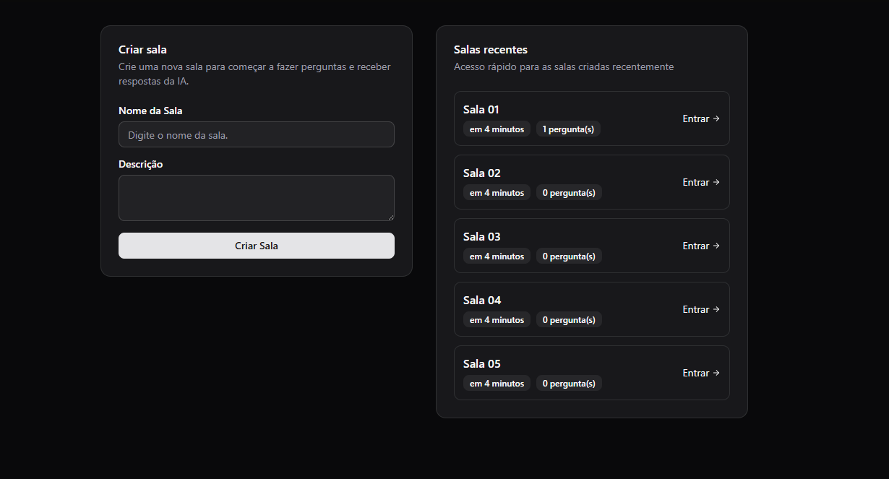
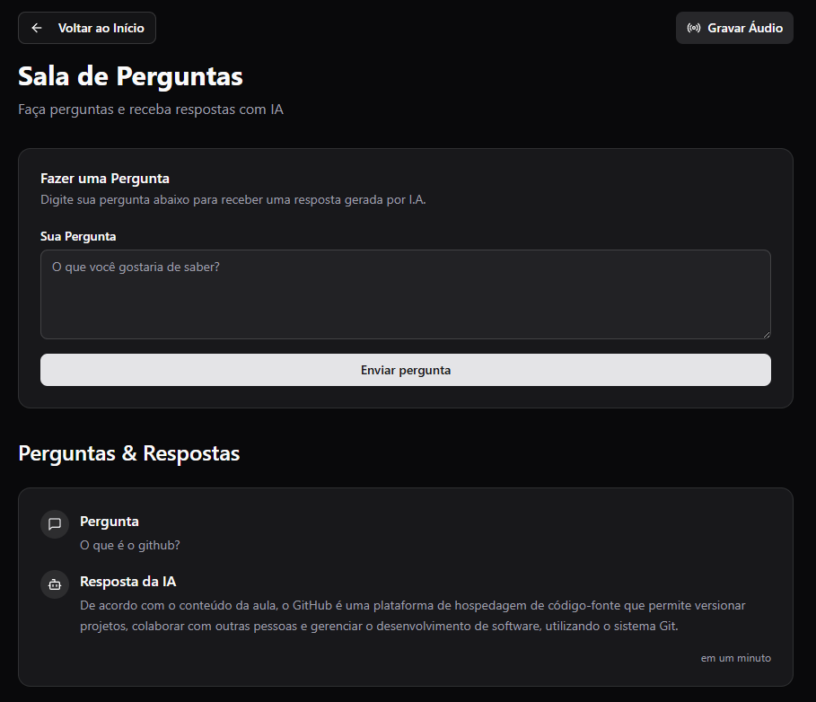

## 📄 `README-pt.md` (Português)

# LetMeAsk

LetMeAsk é uma aplicação web full stack que permite aos usuários criar salas interativas e enviar perguntas por áudio. Os áudios são transcritos e processados com a IA Gemini para gerar perguntas automaticamente para discussão ou aprendizado.

## 🚀 Stack de Tecnologias

**Frontend:**
- React
- TypeScript
- React Router
- Axios

**Backend:**
- Node.js
- Express
- Prisma (ORM)
- PostgreSQL
- Integração com Gemini AI

## ✨ Funcionalidades

- Criação dinâmica de salas
- Gravação e envio de áudios
- Transcrição e geração de questões com IA Gemini
- Visualização de todas as salas e suas perguntas
- Interface responsiva para gerenciamento das salas

## 💻 Como executar localmente

### Pré-requisitos

- Node.js e npm
- PostgreSQL instalado

### Clonar o repositório

```bash
git clone https://github.com/gabrielsouzacampos/LetMeAsk.git
cd LetMeAsk
```

### Backend Setup

```bash
cd server
npm install
npx prisma generate
npx prisma migrate dev
npm run dev
```

### Frontend Setup

```bash
cd client
npm install
npm run dev
```

### 📸 Capturas de tela
<p style="display: flex; justify-content: space-evenly; align-items: start;">
  
  
</p>
